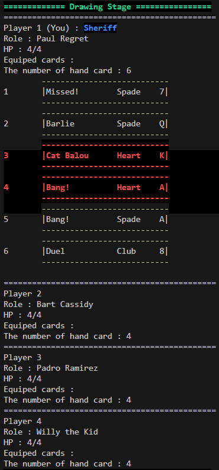
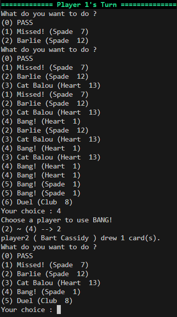

# Bang! 桌遊 (C 語言實作)

這是一個用 C 語言撰寫的知名桌遊 Bang! 的簡單實作版本。

## 專案介紹

- **遊戲名稱**：Bang!
- **語言**：C 語言
- **功能**：遊戲邏輯、角色初始化、卡牌操作等基本功能
- **遊戲形式**：尚無圖形化介面，以命令列形式進行遊玩

## 目錄結構

- `main.c`：遊戲主入口
- `func.h`：遊戲功能函數宣告
- `func.c`：遊戲功能實作
- `bang.exe`：遊戲檔案

## 編譯與運行

執行編譯指令： gcc main.c func.c -o bang

就會產生 bang.exe

運行指令：./bang

## 專案特色

- 遊戲角色和卡牌的定義清晰
- 實現了遊戲中卡牌的發牌、抽牌、棄牌等機制
- 簡單易懂的遊戲流程與回合控制

## 未來改進

- 改進使用者介面與交互體驗